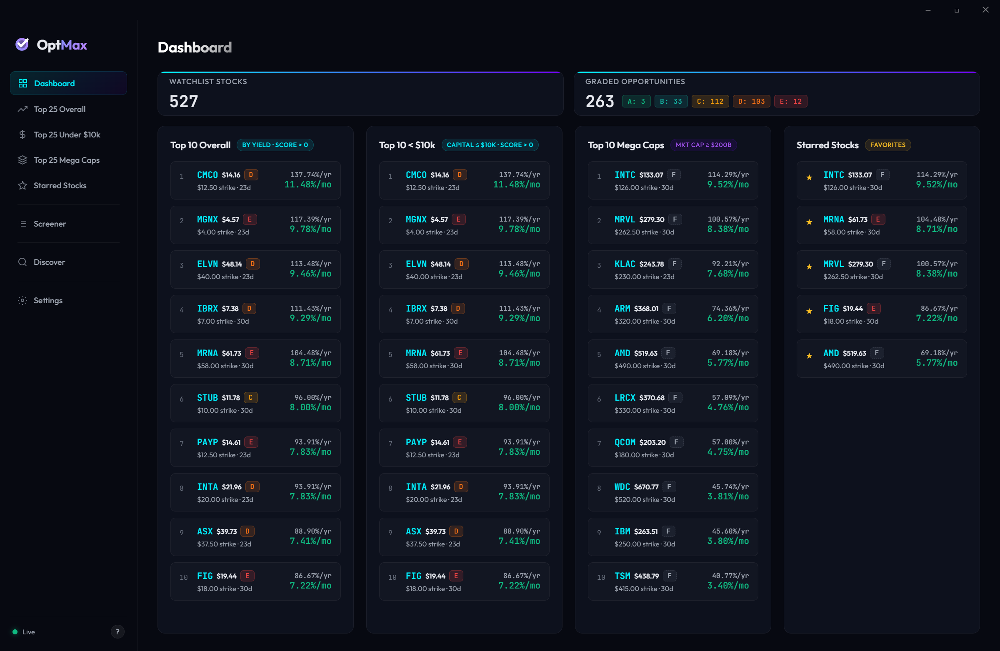
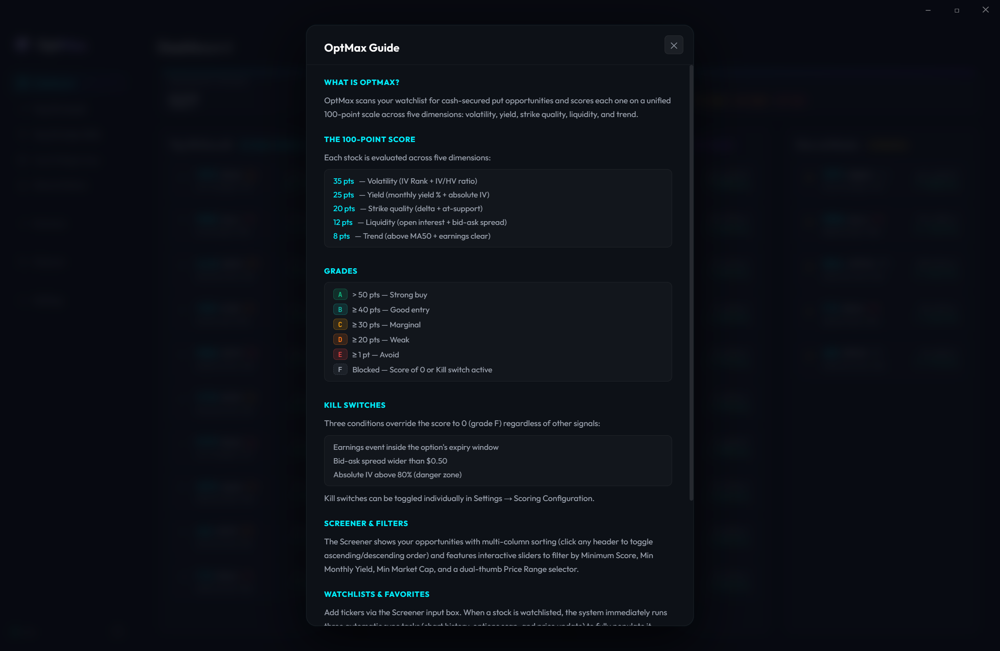

# OptMax

A desktop application for finding and tracking cash-secured put opportunities. OptMax scans options chains in real time, scores each opportunity using a unified **100-Point Scoring Engine**, and ranks them across multi-column sortable lists — so you spend less time screening and more time trading.


---

## Features

### Opportunity Discovery
- **Market Scanner** — Scans the **200–300** most active and volatile stocks on Yahoo Finance, runs full options analysis across three strategies, and ranks the candidates.
- **Auto-Watchlist & Cache Merge** — Discovered opportunities are automatically added to the unified watchlist and merged directly into the main data cache with fresh timestamps, making them instantly visible across all screens.
- **Smart 1h Freshness Bypass** — Full options scans and price updates are skipped for any stock if its cached data is less than 1 hour fresh and contains `marketCap` data, preventing API rate-limiting and ensuring blazing-fast stock additions.

### The 100-Point Scoring Engine
Each opportunity is evaluated across five core risk-return dimensions:
- <span style="color:var(--cyan)">**Volatility (35 pts)**</span> — IV Rank (max 25 pts) + IV/HV Ratio (max 10 pts).
- <span style="color:var(--cyan)">**Yield (25 pts)**</span> — Monthly Yield % (max 15 pts) + Absolute Implied Volatility (max 10 pts).
- <span style="color:var(--cyan)">**Strike Quality (20 pts)**</span> — Delta sweet-spot (max 10 pts) + Support bounce check (max 10 pts).
- <span style="color:var(--cyan)">**Liquidity (12 pts)**</span> — Open Interest (max 6 pts) + Bid-Ask Spread (max 6 pts).
- <span style="color:var(--cyan)">**Trend (8 pts)**</span> — Position above MA50 (max 4 pts) + Earnings event cleared (max 4 pts).

### Letter Grades (A–F)
Scores are mapped to a clear letter grade scale with professional color-coded badges:
- <span class="grade-badge grade-badge-A">A</span> &gt; 50 pts — Strong buy (Green)
- <span class="grade-badge grade-badge-B">B</span> ≥ 40 pts — Good entry (Teal)
- <span class="grade-badge grade-badge-C">C</span> ≥ 30 pts — Marginal (Amber)
- <span class="grade-badge grade-badge-D">D</span> ≥ 20 pts — Weak (Orange)
- <span class="grade-badge grade-badge-E">E</span> ≥ 1 pt — Avoid (Red)
- <span class="grade-badge grade-badge-F">F</span> Blocked — Score of 0 or Kill switch active (Muted Gray)

### Active Safety Kill Switches
Scoring is overridden to 0 (Grade F) if any active risk filter is triggered:
- Earnings event inside the option's expiry window.
- Bid-ask spread wider than `$0.50` (liquidity block).
- Absolute implied volatility above `80%` (extreme danger zone).
- *Kill switches can be toggled individually under Settings.*

### High-Impact Dashboard
- **Sleek Metric Cards** — Compacted top row showing **Watchlist Stocks** and **Graded Opportunities** side-by-side. The Graded Opportunities card features inline colored sub-boxes showing active counts per grade, automatically hiding zero-count categories.
- **Stacked Yield Display** — Dashboard items stack **Monthly Yield** (prominent green, e.g. `1.50%/mo`) as the main highlight directly below **Yearly/Annualized Yield** (secondary gray, e.g. `18.00%/yr`).
- **Top 10 Previews** — Lists the highest-yielding opportunities across:
  - **Top 10 Overall** (score > 0)
  - **Top 10 < $10k** (priced ≤ $100, score > 0)
  - **Top 10 Mega Caps** (market cap ≥ $200B, includes blocked/0-score items)
  - **Starred Stocks** (your favorites toggled in Screener/details)

### Interactive Screener & Sorting
- **Multi-Column Click-to-Sort** — Click any table header (including Score, Symbol, Price, Strike, Yields, DTE, etc.) to toggle ascending or descending order.
- **Advanced Filtering Sliders** — Set interactive sliders to filter by Minimum Score, Min Monthly Yield, Min Market Cap, and a dual-thumb overlapping Price Range selector.

### Deep-Dive Analysis Modal
Click **Analyze** or **Detail** on any row to open a deep-dive window with:
- 30-day stock price chart with smooth gradient fill.
- Trade mechanics explained in plain English.
- Destructive **Danger Block Explanations** explaining exactly which active kill switch blocked the opportunity.
- Options data grid and a persistent Star (`☆`/`★`) button to mark favorites.

---

## Screenshots





---

## Tech Stack

| Layer | Technology |
|---|---|
| Shell | [Electron](https://www.electronjs.org/) 42 |
| Frontend | Vanilla HTML5 / CSS3 / JavaScript (ES6+) |
| Data | [yahoo-finance2](https://github.com/gadicc/node-yahoo-finance2) |
| Charts | [Chart.js](https://www.chartjs.org/) (CDN) |
| Packaging | [electron-builder](https://www.electron.build/) |

---

## Getting Started

### Prerequisites
- [Node.js](https://nodejs.org/) 18 or later
- npm

### Install & Run

```bash
git clone https://github.com/juliantoledo/optmax.git
cd optmax
npm install
npm start
```

### Build Installer (Windows)

```bash
npm run build
# Output: dist/OptMax Setup 1.1.1.exe
```

---

## Running Tests

```bash
npm test
```

37 unit and structure validation tests covering HV calculations, IVR calculations, Mean Reversion signals, scoring config defaults, and SEED validation.

---

## Disclaimer

OptMax is a personal research tool. Nothing in this application constitutes financial advice. Options trading involves substantial risk of loss. Always do your own due diligence before entering any trade.

---

## License

ISC
