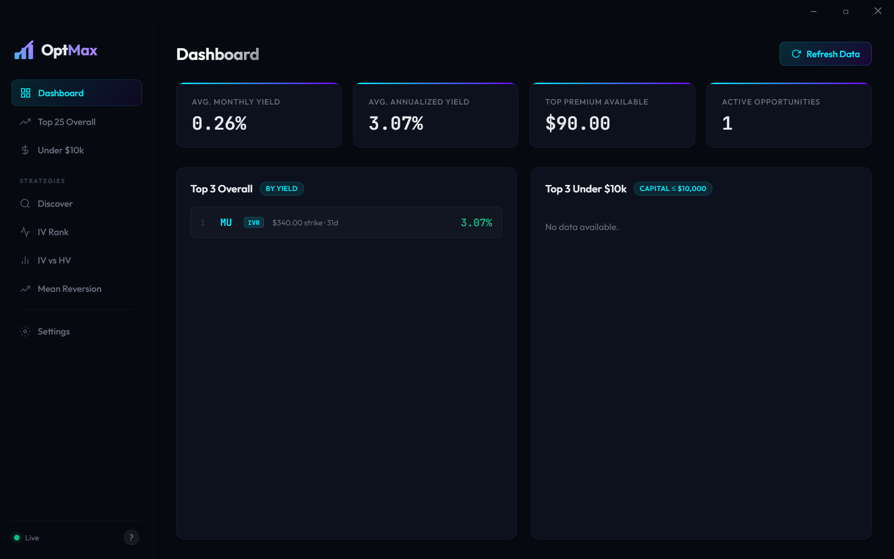
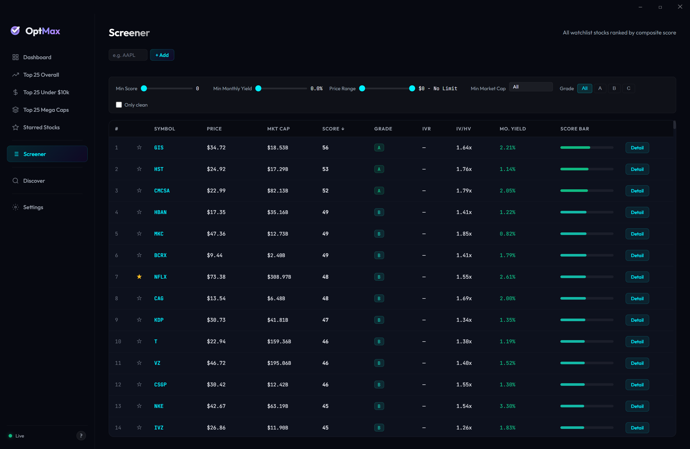
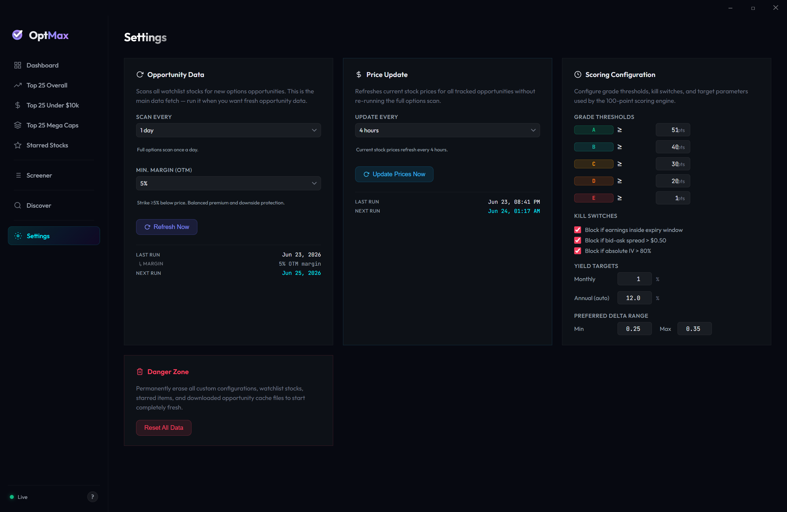
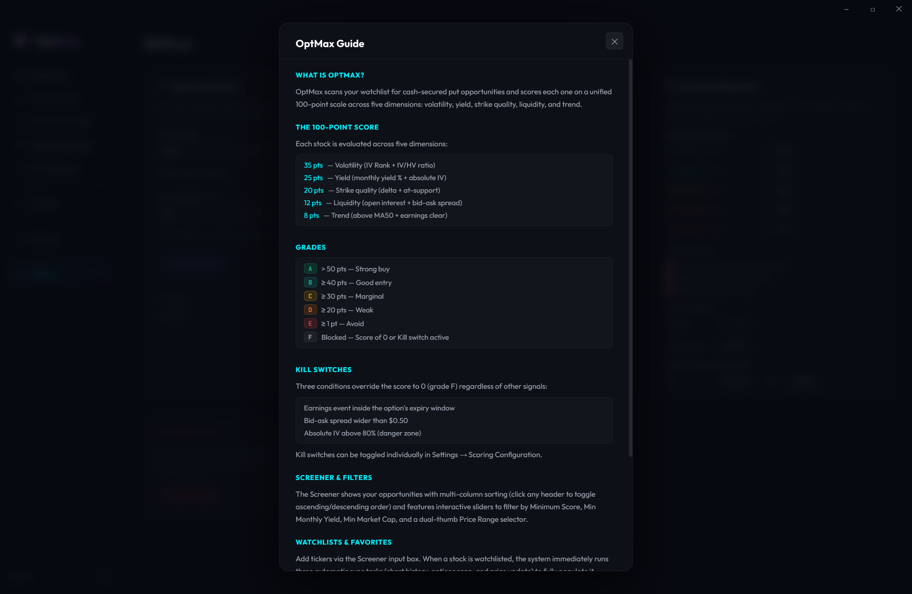

# OptMax

A desktop application for finding and tracking cash-secured put opportunities. OptMax scans options chains in real time, scores each opportunity using a unified **100-Point Scoring Engine**, and ranks them across multi-column sortable lists — so you spend less time screening and more time trading.


---

## Screenshots






---

## Features

### Opportunity Discovery
- **Market Scanner (Discover)** — Scans the **200–300** most active and volatile stocks on Yahoo Finance across three source lists (Most Active, Day Losers, Growth Tech), runs full options analysis, and ranks every candidate by composite score. Results are automatically added to your Watchlist and merged into the main data cache.
- **Smart 1h Freshness Bypass** — Full options scans and price updates are skipped for any stock if its cached data is less than 1 hour old and contains `marketCap` data, preventing API rate-limiting and ensuring fast stock additions.

### The 100-Point Scoring Engine
Each opportunity is evaluated across five core risk-return dimensions:
- **Volatility (35 pts)** — IV Rank (max 25 pts) + IV/HV Ratio (max 10 pts).
- **Yield (25 pts)** — Monthly Yield % (max 15 pts) + Absolute Implied Volatility (max 10 pts).
- **Strike Quality (20 pts)** — Delta sweet-spot (max 10 pts) + Support bounce check (max 10 pts).
- **Liquidity (12 pts)** — Open Interest (max 6 pts) + Bid-Ask Spread (max 6 pts).
- **Trend (8 pts)** — Position above MA50 (max 4 pts) + Earnings event cleared (max 4 pts).

### Letter Grades (A–F)
Scores map to a clear letter grade scale with color-coded badges:
- **A** ≥ 50 pts — Strong buy (Green)
- **B** ≥ 40 pts — Good entry (Teal)
- **C** ≥ 30 pts — Marginal (Amber)
- **D** ≥ 20 pts — Weak (Orange)
- **E** ≥ 1 pt — Avoid (Red)
- **F** Blocked — Score of 0 or Kill switch active (Muted Gray)

### Active Safety Kill Switches
Scoring is overridden to 0 (Grade F) if any active risk filter is triggered:
- Earnings event inside the option's expiry window.
- Bid-ask spread wider than `$0.50` (liquidity block).
- Absolute implied volatility above `80%` (extreme danger zone).
- *Kill switches can be toggled individually under Settings → Scoring Configuration.*

### High-Impact Dashboard
- **Metric Cards** — Compacted top row showing **Watchlist Stocks** and **Graded Opportunities** side-by-side. The Graded Opportunities card features inline colored sub-boxes showing active counts per grade, hiding zero-count categories automatically.
- **Stacked Yield Display** — Each list item shows **Monthly Yield** (prominent green) stacked above **Yearly/Annualized Yield** (secondary gray).
- **Four Top-10 Previews** — Highest-yielding opportunities across: **Top 10 Overall**, **Top 10 < $10k**, **Top 10 Mega Caps** (mkt cap ≥ $200B), and **Starred Stocks**.

### Screener
- **Full Watchlist Table** — Every watchlisted stock ranked by composite score with columns for Price, Market Cap, Score, Grade, IVR, IV/HV, Monthly Yield, and a Score Bar.
- **Multi-Column Click-to-Sort** — Click any column header to toggle ascending/descending order.
- **Advanced Filters** — Interactive sliders for Minimum Score, Min Monthly Yield, and Min Market Cap; a dual-thumb Price Range selector; and a Grade filter chip row (All / A / B / C).
- **Watchlist Management** — Add tickers directly from the Screener input. Starred stocks are persisted and sync across all views.

### Ranked List Views
Four dedicated sorted tables, each sortable by any column:
- **Top 25 Overall** — Best opportunities by annualized yield (score > 0).
- **Top 25 Under $10k** — Stocks priced ≤ $100 (capital requirement ≤ $10,000, score > 0).
- **Top 25 Mega Caps** — Market cap ≥ $200B, includes blocked/0-score items.
- **Starred Stocks** — Your favorited opportunities.

### Deep-Dive Analysis Modal
Click **Detail** on any row to open a modal with:
- 30-day stock price chart with smooth gradient fill.
- Trade mechanics explained in plain English.
- Danger Block explanations detailing exactly which kill switch blocked the opportunity.
- Options data grid and a persistent Star (☆/★) toggle to mark favorites.

### Settings
- **Opportunity Data** — Configure scan interval and minimum OTM margin; trigger a manual refresh.
- **Price Update** — Set automatic price refresh cadence or trigger on demand.
- **Scoring Configuration** — Adjust grade thresholds (A–E), enable/disable each kill switch, set yield targets, and configure the preferred delta range.
- **Danger Zone** — Reset all data to start fresh.

---

## Tech Stack

| Layer | Technology |
|---|---|
| Shell | [Electron](https://www.electronjs.org/) 42 |
| Frontend | Vanilla HTML5 / CSS3 / JavaScript (ES6+) |
| Data | [yahoo-finance2](https://github.com/gadicc/node-yahoo-finance2) |
| Charts | [Chart.js](https://www.chartjs.org/) (CDN) |
| Packaging | [electron-builder](https://www.electron.build/) |

---

## Getting Started

### Prerequisites
- [Node.js](https://nodejs.org/) 18 or later
- npm

### Install & Run

```bash
git clone https://github.com/juliantoledo/optmax.git
cd optmax
npm install
npm start
```

### Build Installer (Windows)

```bash
npm run build
# Output: dist/OptMax Setup 1.2.0.exe
```

---

## Running Tests

```bash
npm test
```

59 unit tests covering HV calculations, IVR calculations, Mean Reversion signals, the legacy composite scorer, the full 100-Point Scoring Engine (kill switches, grade assignment, per-dimension scoring, config overrides), and seed data validation.

---

## Disclaimer

OptMax is a personal research tool. Nothing in this application constitutes financial advice. Options trading involves substantial risk of loss. Always do your own due diligence before entering any trade.

---

## License

ISC
